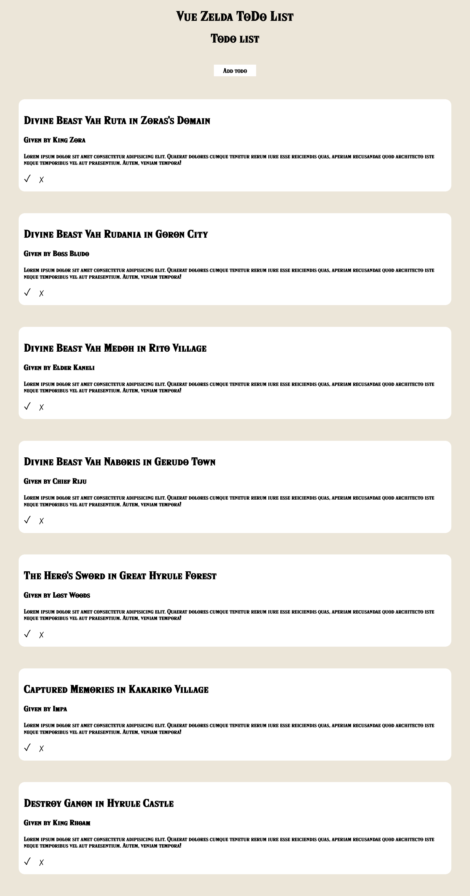

## Table of contents

- [Overview](#overview)
  - [To Do project](#to-do-project)
  - [Project setup](#project-setup)
  - [Screenshot](#screenshot)
  - [Author](#author)

## Overview

### To Do project

Welcome to my Zelda inspired to do list. Built using vueJs with Scss/sass, typeScript and single file component via vueJs.

This project was created in order to know more about VueJs a JavaScript framework. It is also my first vuejs project, which means that nearly everything about this project was unknown to me at first.

Almost all textual information comes from Nintendo's "The Legend of Zelda Breath Of The Wild" game.
[Zelda BOTW](https://www.zelda.com/breath-of-the-wild/).

## Project setup

```
npm install
```

### Compiles and hot-reloads for development

```
npm run serve
```

### Compiles and minifies for production

```
npm run build
```

### Lints and fixes files

```
npm run lint
```

### Screenshot



### Author

[Github](https://github.com/Rasweb)

[Website](https://rasweb.one/)
